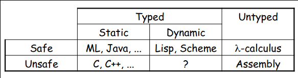

# Type Systems

## Introduction

- Fundamental purpose of a type system is to prevent _execution errors_ during runtime
- The absence of execution errors is a _nontrivial_ property
- Informal descriptions of type systems are imprecise and lead to ambiguities
  - There are different compilers for the same language that implement slightly different type systems
- Many languages have been found to be type unsound
  - Program crashes although it was accepted by the type checker

## Types

- A type is a set of values which specifies the range of a variable
- Examples in Java:
  - `int` is the set of all integers between $-2^{31}$ and $2^{31}-1$
  - `double` is the set of all double-precision floating point numbers
  - `boolean` is the set $\{ \texttt{true}, \texttt{false} \}$
  - `Foo` is the set of all objects of class `Foo`
  - `List<Integer>` is the set of all `Lists` of `Integer` objects
    - `List` is a _type constructor_
    - `List` acts as a function from types to types
  - `int -> int` is the set of all functions taking an `int` as input and returning another `int`
- A type is an example of an _abstract value_
  - Represents a _set_ of _concrete_ values

## Typed and Untyped Languages

### Typed Languages

- Every variable has a nontrivial type
- A type system keeps track of types
- Languages can be _explicitly typed_ or _implicitly typed_

### Untyped Languages

- Do not restrict the range of values for a given variable
- Either no types at all; or one universal type for all variables (e.g. `any`)
- Operations may be applied to inappropriate arguments
- The result may be a fixed arbitrary value, a fault, an exception or an unspecified result
- The pure $\lambda$-calculus is an extreme example of an untyped language where no fault ever occurs
- The only operation is function application and all values are functions; so that operation never fails

## Execution Errors

- There are two kinds of execution errors
- A program is considered _safe_ if it does not cause untrapped errors
  - Languages in which all programs are safe are called _safe languages_
- For a given language designate a set of _forbidden errors_
  - A superset of the untrapped errors
  - Includes some trapped errors as well

### Trapped Execution Errors

- Cause computation to stop immediately
- Well-specified behaviour
- Usually enforced by hardware
- Examples: division by zero, accessing illegal address

### Untrapped Execution Errors

- Might go unnoticed for a while and have arbitrary behaviour is unspecified
- Examples: Accessing past the end of an array

## Preventing Forbidden Errors

- Forbidden errors can be caught by a combination of static and runtime checking
- Certain errors can only be caught at runtime

### Static Checking

- Errors are detected early, before the program runs
- Types provide necessary static information for static checking
- Detecting certain/most errors statically is not possible in most languages

### Dynamic Checking

- Required when static checking is undecidable (e.g. array-bounds checking)
- Runtime encodings of types are still used
- Should be limited, since it delays finding errors
- Dynamically checked languages can still be strongly checked, even thought they do not have static checking or a type system

## Safe Languages

- There are typed languages that are not safe (weakly typed languages)
- Only some unsafe operations are detected and not all
- C is unsafe by design because of performance considerations
- Ensuring safety has a cost, since some checks can only be done at runtime

## Advantages of Typed Languages

### Development

- Type checking catches errors early
- Reduced debugging time
- Type signatures serve as documentation and also enable separate compilation

### Maintenance

- Types act as checked specifications
- Breaking changes to the code base can be catched
- Types can enforce abstractions

### Execution

- Static checking reduces the need for dynamic checking
- Safe languages are easier to analyze statically, allowing for the compile to generate better code

## Disadvantages of Typed Languages

- Static type checking imposes constraints on the programmer
  - Some valid programs might be rejected
  - Hard to step outside the language
- Dynamic safety checks can be costly
- Some applications are justified to use weakly-typed languages

## Properties of Type Systems

- Types are more precise than comments
- Types are more easily mechanizable than program specifications

- Expected properties:
  1. Types should be enforceable
    - Type declarations should be checked statically as much as possible
  2. Types should be decidably verifiable
    - There should be a typechecking algorithm that can ensure that a program is well-typed
  3. Typing rules should be transparent 
    - It should be easy to see why a program is not well-typed
    - If it fails, the reason should be clear

## Why Formal Type Systems?

- Many typed languages have informal descriptions of their type system (e.g. in language reference manuals)
- A fair amount of careful analysis is required to avoid false claims of type safety
- A formal presentation of a type system is a precise specification of the type checker
  - And allows formal proofs of type safety

## Formalizing a Type System

A multi-step process:

1. Syntax
  - For expressions, statements, ... (express algorithmic behavior)
  - For types (express static knowledge)
2. Static semantics (typing rules)
  - Define the typing judgment and its derivation rules
3. Dynamic semantics (e.g. operational)
  - Define the evaluation judgment and its derivation rules
4. Type soundness
  - Relates the static and dynamic semantics
  - State and prove the soundness theorem

## References

- [Type Systems](http://lucacardelli.name/Papers/TypeSystems.pdf) by Luca Cardelli
- [Lecture slides](https://web.cs.ucdavis.edu/~su/teaching/ecs240-w17/lectures/lecture14.pdf) from ECS 240 @ UCDavis
- [Type Systems lecture](https://www.youtube.com/watch?v=dGbRLowf6ys) by Mayur Naik
